# Gmail Attachment Extractor

[](https://opensource.org/licenses/MIT)
[](https://script.google.com/)

**Extract email attachments from Gmail to Google Drive while preserving folder structure.**

A Google Apps Script tool that automatically extracts attachments from Gmail and organizes them in Google Drive, maintaining your Gmail label hierarchy as folders.

---

## ✨ Features

- 📁 **Preserves Gmail Label Structure** - Labels become folders in Drive
- 🔍 **Wildcard Pattern Matching** - Use patterns like `*project*`, `Work/*`, `*inbox*`
- 🔄 **Auto-Resume Capability** - Handles large mailboxes with batching
- 🔐 **Privacy & Security Checks** - Warns about public sharing
- 🚫 **Intelligent Duplicate Handling** - Auto-renames duplicates (file-2.pdf)
- 🎯 **System Label Support** - Works with Inbox, Sent, Starred, etc.
- 📊 **Progress Tracking** - Extraction log with success/error stats
- 🎨 **User-Friendly Setup** - Auto-setup on first run

---

## 🚀 Quick Start

### Prerequisites
- Google account with Gmail
- Google Drive access
- ~5 minutes for setup

### Installation

1. **Create a Google Sheet:**
   - Go to [Google Sheets](https://sheets.google.com)
   - Click "Blank" to create new sheet

2. **Open Apps Script Editor:**
   - In your sheet, click `Extensions` → `Apps Script`

3. **Add the Script:**
   - Delete the placeholder code
   - Copy all code from `gmail-attachments-extractor.gs`
   - Paste into the editor
   - Click Save (💾 icon)

4. **Run Setup:**
   - Close Apps Script tab
   - Refresh your Google Sheet (F5)
   - Wait ~10 seconds for menu to load
   - Click `Attachment Tools` → `Extract Attachments`
   - First time: Approve permissions
   - Auto-setup creates Configuration tabs

5. **Configure Patterns:**
   - Go to Configuration tab
   - Update "Folder Patterns" (Cell B4) with your Gmail labels
   - Examples: `*project*`, `Work/*`, `*inbox*`

6. **Extract Attachments:**
   - Click `Attachment Tools` → `Extract Attachments`
   - Review confirmation dialog
   - Click Yes to start

**That's it!** Check Google Drive for "Gmail Attachments" folder.

---

## 📋 Configuration Options

| Setting | Location | Description | Example |
|---------|----------|-------------|---------|
| **Drive Folder Name** | Cell B2 | Name of root folder in Drive | `Gmail Attachments` |
| **Drive Folder ID** | Cell B3 | Auto-populated on first run | *(auto)* |
| **Folder Patterns** | Cell B4 | Gmail label patterns to match | `*covid*, Projects/*` |
| **Search Trash Only** | Cell B5 | Extract only from trash | `FALSE` |
| **Batch Size** | Cell B6 | Threads per execution (1-50) | `20` |

### Pattern Examples

```
*project*           → Any label containing "project"
Work/*              → All labels under "Work"
*inbox*             → System Inbox folder
*starred*           → Starred emails
Projects/COVID      → Exact label match
*project*, Work/*   → Multiple patterns
```

---

## 📂 Folder Structure

Attachments are saved to Google Drive following this structure:

```
Gmail Attachments/
  attachments/
    Projects/
      COVID/
        2023/
          report_2024-03-15.pdf
          data_2024-03-15.xlsx
    Work/
      Invoices/
        invoice_2024-01-10.pdf
    INBOX/
      image_2024-11-07.jpg
```

- Label hierarchy preserved
- Filenames include sent date: `filename_YYYY-MM-DD.ext`
- Duplicates auto-renamed: `file_2024-01-15-2.pdf`

---

## 🏗️ Architecture

### System Overview

```mermaid
graph TB
    User[👤 User] -->|Opens & Configures| Sheet[📊 Google Sheet]
    Sheet -->|Triggers Extraction| Script[⚙️ Apps Script]

    Script -->|Reads Config| Config[🔧 Configuration]
    Script -->|Searches Emails| Gmail[📧 Gmail API]
    Script -->|Saves Files| Drive[📁 Drive API]
    Script -->|Writes Logs| Log[📋 Extraction Log]
    Script -->|Manages State| State[💾 Script Properties]

    Config -.->|Named Ranges| Sheet
    Log -.->|Appends Rows| Sheet

    Gmail -->|Returns Threads| Script
    Drive -->|Confirms Upload| Script

    style User fill:#e1f5ff
    style Sheet fill:#fff4e1
    style Script fill:#e8f5e9
    style Gmail fill:#ffebee
    style Drive fill:#f3e5f5
```



### Detailed Architecture Diagrams

#### Process Flow
Complete activity diagram showing all 10 steps of the extraction process:


#### Sequence Diagram
Detailed interaction flow between components:


#### C4 Architecture Model

**Context Diagram** - System in its environment:


**Container Diagram** - Technology stack and data stores:


**Component Diagram** - Internal architecture and component interactions:


For more diagrams and architectural details, see [docs/diagrams/](docs/diagrams/).

---

## 🔒 Security & Privacy

### Built-in Security Features:
- ✅ **Privacy Warnings** - Alerts if Sheet/Drive is publicly shared
- ✅ **Execution Locks** - Prevents concurrent runs
- ✅ **Per-User Isolation** - Each user gets their own Drive folder
- ✅ **No External Data** - Everything stays in your Google account

### What the Script Can Access:
- ✓ Your Gmail messages and attachments
- ✓ Your Google Drive (to save files)
- ✓ The Google Sheet (for configuration)

### What the Script CANNOT Access:
- ✗ Other users' emails (even on shared sheets)
- ✗ Your passwords or credentials
- ✗ Data outside your Google account

---

## 🐛 Troubleshooting

### Common Issues

**"No emails found matching your folder patterns"**
- Check that patterns match your actual Gmail labels
- Try `*inbox*` to test with inbox emails
- Patterns are case-insensitive

**"Extraction In Progress" error**
- Wait 30 seconds for locks to expire
- Check for duplicate browser tabs
- Use `Attachment Tools` → `🔧 Force Release Lock`

**Authorization errors**
- Click "Advanced" when seeing "unsafe app" warning
- This is normal for personal scripts
- Only you can access your data

**See [TROUBLESHOOTING-GUIDE.md](TROUBLESHOOTING-GUIDE.md) for detailed solutions.**

---

## 📚 Documentation

- **[DEPLOYMENT-GUIDE.md](DEPLOYMENT-GUIDE.md)** - Complete setup walkthrough
- **[TROUBLESHOOTING-GUIDE.md](TROUBLESHOOTING-GUIDE.md)** - Debug help
- **[AUTO-SETUP-UPDATE.md](AUTO-SETUP-UPDATE.md)** - Auto-setup feature explained
- **[docs/diagrams/](docs/diagrams/)** - Architecture diagrams and visual documentation
- **[gmail-apps-script-attachments-extractor-PDD.md](gmail-apps-script-attachments-extractor-PDD.md)** - Full product design document

---

## ⚡ Performance

| Mailbox Size | Batch Size | Time per Batch | Total Time (est.) |
|--------------|------------|----------------|-------------------|
| 50 emails    | 20         | 1-2 min        | 5-10 min          |
| 200 emails   | 20         | 2-3 min        | 20-30 min         |
| 500 emails   | 20         | 2-4 min        | 50-100 min        |

- Script auto-resumes if execution times out
- Larger batch sizes = fewer manual re-runs
- Processed attachments won't be re-extracted

---

## 🤝 Contributing

Contributions welcome! Please:
1. Fork the repository
2. Create a feature branch
3. Test thoroughly with Google Apps Script
4. Submit a pull request

---

## 📄 License

This project is licensed under the MIT License - see the [LICENSE](LICENSE) file for details.

---

## 🙏 Acknowledgments

Built with:
- [Google Apps Script](https://developers.google.com/apps-script)
- [Gmail API](https://developers.google.com/gmail/api)
- [Drive API](https://developers.google.com/drive/api)

---

## ⚠️ Disclaimer

This tool is provided as-is for personal use. Always:
- Back up important data before running
- Test with a small subset first
- Review privacy settings on your Sheet and Drive
- Understand the permissions you're granting

The script runs entirely within your Google account and does not send data externally.

---

## 👤 Author

**Ben @ delusionalsecurity.review**

- Website: [delusionalsecurity.review](https://delusionalsecurity.review)
- GitHub: [@bbleak-repo](https://github.com/bbleak-repo)

---

## 📞 Support

- **Issues:** [GitHub Issues](../../issues)
- **Discussions:** [GitHub Discussions](../../discussions)
- **Documentation:** See [DEPLOYMENT-GUIDE.md](DEPLOYMENT-GUIDE.md)

---

## 🗺️ Roadmap

Future enhancements:
- [ ] Python desktop version for offline processing
- [ ] Scheduled automatic extraction
- [ ] Advanced filtering (by date, sender, size)
- [ ] Export to ZIP archives
- [ ] Support for additional cloud storage providers

---

**Happy extracting!** 📧 → 📁
