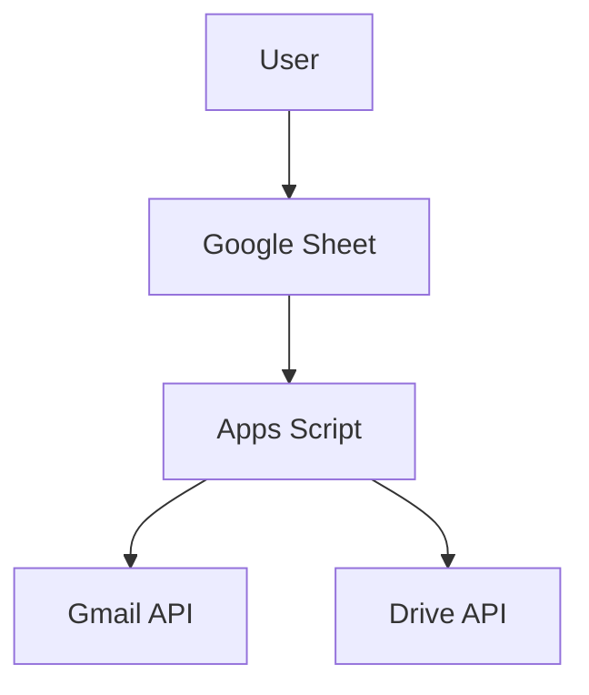

# Architecture Diagrams

This directory contains comprehensive architectural diagrams for the Gmail Attachment Extractor project.

---

## 📊 Available Diagrams

### Mermaid Diagrams
**File:** `mermaid-system-overview.md`

These can be rendered directly in GitHub:
1. **System Overview** - High-level system architecture
2. **User Flow** - Sequence of user interactions
3. **Data Flow** - How data moves through the system
4. **Component Architecture** - Internal component relationships
5. **State Management** - State transitions during extraction

---

### PlantUML Diagrams

#### Sequence Diagram
**File:** `plantuml-sequence.puml`

Detailed sequence showing:
- User interactions
- Initialization and setup
- Gmail search operations
- Batch processing
- State management
- Error handling flows

#### Activity Diagram
**File:** `plantuml-activity.puml`

Complete process flow including:
- All 10 main steps
- Decision points
- Error paths
- Retry logic
- State persistence

#### C4 Architecture Diagrams

**C4 Context:** `plantuml-c4-context.puml`
- System context
- External actors
- External systems (Gmail, Drive, Sheets)
- High-level relationships

**C4 Container:** `plantuml-c4-container.puml`
- Technology choices
- Data stores
- APIs used
- Container relationships

**C4 Component:** `plantuml-c4-component.puml`
- Internal components
- Function responsibilities
- Component interactions
- Detailed architecture

---

## 🖼️ Converting to PNG

### Using PlantUML Converter

Navigate to your PlantUML converter project:

```bash
cd "G:\Coding\PlantUML"
```

### Convert Individual Files

```bash
# Sequence diagram
java -jar plantuml.jar "G:\Coding\Gmail-Scripts\Email-Extraction\docs\diagrams\plantuml-sequence.puml"

# Activity diagram
java -jar plantuml.jar "G:\Coding\Gmail-Scripts\Email-Extraction\docs\diagrams\plantuml-activity.puml"

# C4 Context
java -jar plantuml.jar "G:\Coding\Gmail-Scripts\Email-Extraction\docs\diagrams\plantuml-c4-context.puml"

# C4 Container
java -jar plantuml.jar "G:\Coding\Gmail-Scripts\Email-Extraction\docs\diagrams\plantuml-c4-container.puml"

# C4 Component
java -jar plantuml.jar "G:\Coding\Gmail-Scripts\Email-Extraction\docs\diagrams\plantuml-c4-component.puml"
```

### Convert All at Once

```bash
# Convert all .puml files in the directory
java -jar plantuml.jar "G:\Coding\Gmail-Scripts\Email-Extraction\docs\diagrams\*.puml"
```

### Output

PNG files will be created in the same directory:
- `plantuml-sequence.png`
- `plantuml-activity.png`
- `plantuml-c4-context.png`
- `plantuml-c4-container.png`
- `plantuml-c4-component.png`

---

## 📝 Embedding in README

### Mermaid (Direct Embedding)

Mermaid diagrams can be embedded directly in GitHub README.md:

```markdown
## System Architecture


\```
```

### PNG Images (After Conversion)

After converting PlantUML diagrams to PNG:

```markdown
## Sequence Diagram


## Activity Flow


## C4 Architecture

### Context


### Container


### Component


```

---

## 🎨 Diagram Styles

### Mermaid
- Theme: Default GitHub theme
- Colors: Google Workspace colors
- Layout: Top-to-bottom flow

### PlantUML
- Theme: Cerulean outline
- C4 styling: Standard C4 model colors
- Layout: Optimized for readability

---

## 🔄 Updating Diagrams

### When to Update

Update diagrams when:
- Adding new features
- Changing architecture
- Modifying data flow
- Updating security features
- Changing external dependencies

### How to Update

1. **Edit source files:**
   - Mermaid: Edit `.md` files directly
   - PlantUML: Edit `.puml` files

2. **Re-convert PlantUML:**
   ```bash
   java -jar plantuml.jar "path/to/modified.puml"
   ```

3. **Commit changes:**
   ```bash
   git add docs/diagrams/*.puml docs/diagrams/*.png
   git commit -m "docs: update architecture diagrams"
   ```

---

## 📖 Documentation

### Diagram Types Explained

**Sequence Diagram:** Shows interactions over time
- Best for: Understanding user flows and API calls
- Audience: Developers, technical users

**Activity Diagram:** Shows process flow
- Best for: Understanding business logic and decision points
- Audience: All users, especially non-technical

**C4 Context:** Shows system in environment
- Best for: High-level system understanding
- Audience: Stakeholders, architects

**C4 Container:** Shows technology choices
- Best for: Understanding deployment and integration
- Audience: Developers, DevOps

**C4 Component:** Shows internal structure
- Best for: Understanding code organization
- Audience: Developers contributing to project

---

## 🛠️ Tools

### Required Software

**For PlantUML:**
- Java Runtime (JRE 8+)
- PlantUML jar file
- Graphviz (for some diagram types)

**For Mermaid:**
- No local tools needed
- Renders directly in GitHub
- Can use Mermaid Live Editor for testing

### Online Editors

**PlantUML:**
- [PlantUML Online](https://www.plantuml.com/plantuml/uml/)
- [PlantText](https://www.planttext.com/)

**Mermaid:**
- [Mermaid Live Editor](https://mermaid.live/)

---

## 📂 File Organization

```
docs/
  diagrams/
    README.md                       # This file
    mermaid-system-overview.md      # Mermaid diagrams (5 diagrams)
    plantuml-sequence.puml          # Sequence diagram source
    plantuml-sequence.png           # Generated image
    plantuml-activity.puml          # Activity diagram source
    plantuml-activity.png           # Generated image
    plantuml-c4-context.puml        # C4 context source
    plantuml-c4-context.png         # Generated image
    plantuml-c4-container.puml      # C4 container source
    plantuml-c4-container.png       # Generated image
    plantuml-c4-component.puml      # C4 component source
    plantuml-c4-component.png       # Generated image
```

---

## ✅ Quick Conversion Checklist

Before committing diagrams to GitHub:

- [ ] All `.puml` files are valid (no syntax errors)
- [ ] All PlantUML files converted to PNG
- [ ] PNG files are reasonably sized (< 1MB each)
- [ ] Mermaid diagrams render correctly in GitHub preview
- [ ] README.md references correct diagram paths
- [ ] All diagrams are up-to-date with current code

---

**Ready to convert!** Use the commands above to generate PNG images from PlantUML source files.
