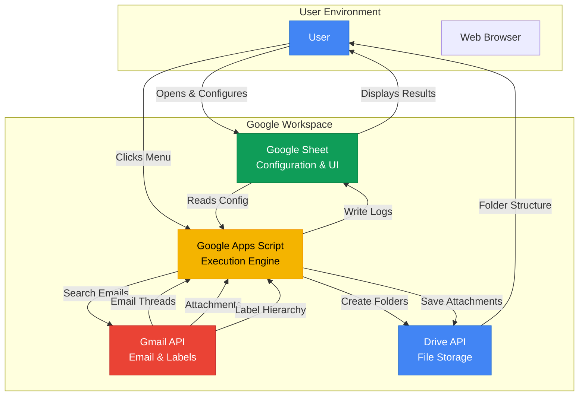
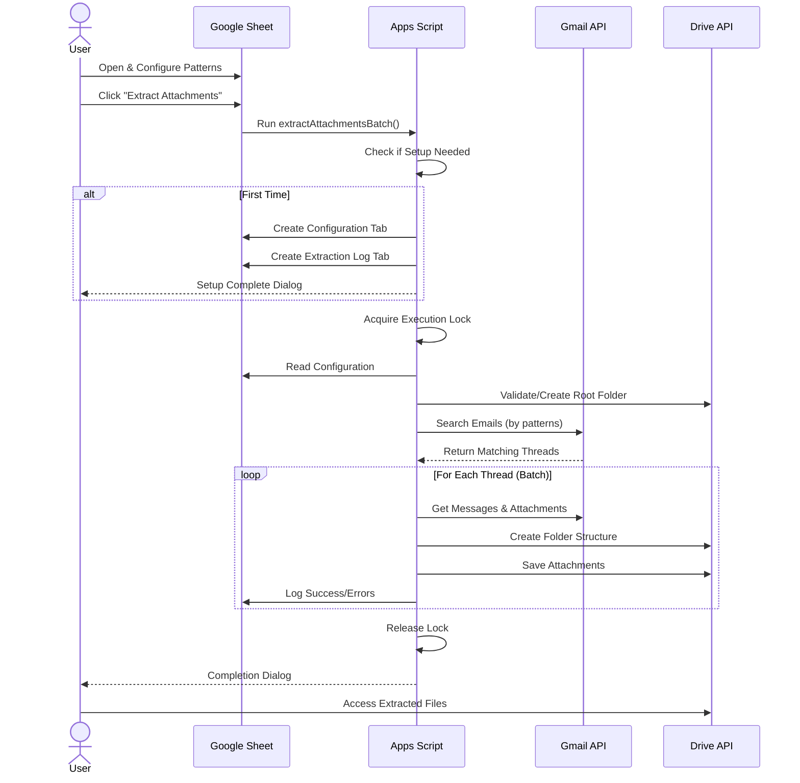
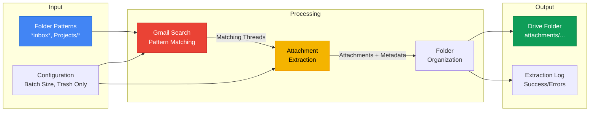
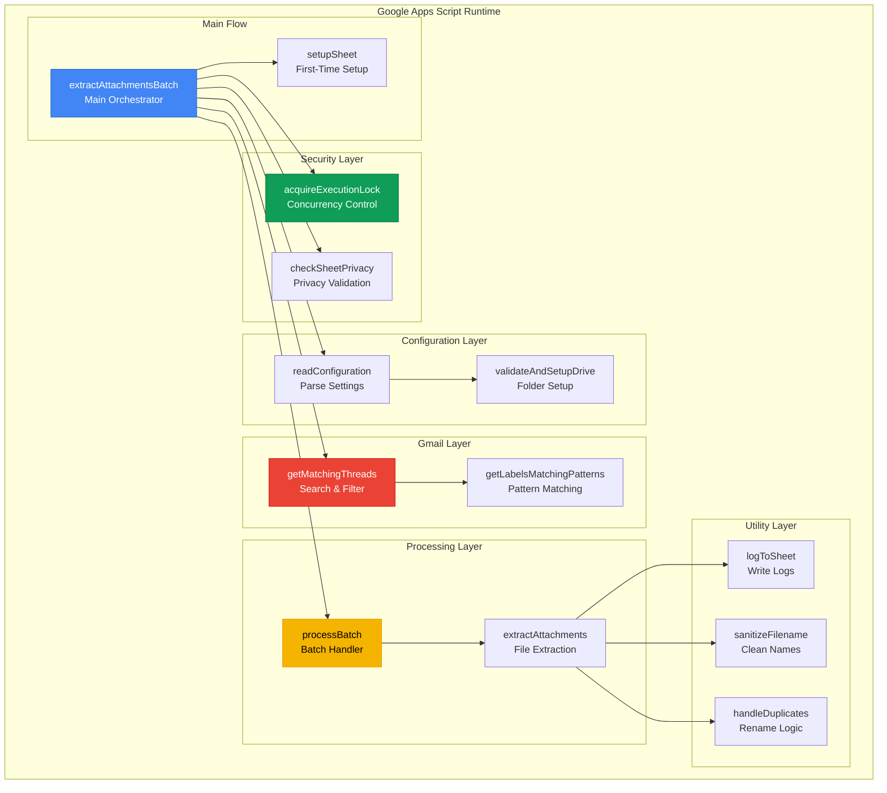
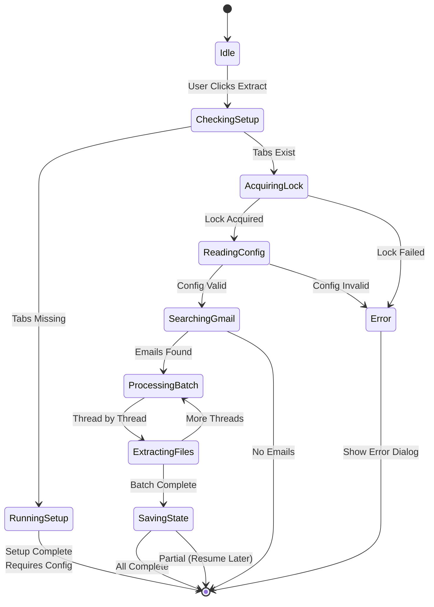

# System Overview - Mermaid Diagram

```mermaid
graph TB
    subgraph "User Environment"
        User[User]
        Browser[Web Browser]
    end

    subgraph "Google Workspace"
        Sheet[Google Sheet<br/>Configuration & UI]
        AppsScript[Google Apps Script<br/>Execution Engine]
        Gmail[Gmail API<br/>Email & Labels]
        Drive[Drive API<br/>File Storage]
    end

    User -->|Opens & Configures| Sheet
    User -->|Clicks Menu| AppsScript

    Sheet -->|Reads Config| AppsScript
    Sheet -->|Displays Results| User

    AppsScript -->|Search Emails| Gmail
    AppsScript -->|Create Folders| Drive
    AppsScript -->|Save Attachments| Drive
    AppsScript -->|Write Logs| Sheet

    Gmail -->|Email Threads| AppsScript
    Gmail -->|Attachments| AppsScript
    Gmail -->|Label Hierarchy| AppsScript

    Drive -->|Folder Structure| User

    style User fill:#4285F4,stroke:#1967D2,color:#fff
    style Sheet fill:#0F9D58,stroke:#0B8043,color:#fff
    style AppsScript fill:#F4B400,stroke:#F29900,color:#000
    style Gmail fill:#EA4335,stroke:#C5221F,color:#fff
    style Drive fill:#4285F4,stroke:#1967D2,color:#fff
```

## User Flow

```mermaid
sequenceDiagram
    actor User
    participant Sheet as Google Sheet
    participant Script as Apps Script
    participant Gmail as Gmail API
    participant Drive as Drive API

    User->>Sheet: Open & Configure Patterns
    User->>Sheet: Click "Extract Attachments"

    Sheet->>Script: Run extractAttachmentsBatch()

    Script->>Script: Check if Setup Needed
    alt First Time
        Script->>Sheet: Create Configuration Tab
        Script->>Sheet: Create Extraction Log Tab
        Script-->>User: Setup Complete Dialog
    end

    Script->>Script: Acquire Execution Lock
    Script->>Sheet: Read Configuration
    Script->>Drive: Validate/Create Root Folder

    Script->>Gmail: Search Emails (by patterns)
    Gmail-->>Script: Return Matching Threads

    loop For Each Thread (Batch)
        Script->>Gmail: Get Messages & Attachments
        Script->>Drive: Create Folder Structure
        Script->>Drive: Save Attachments
        Script->>Sheet: Log Success/Errors
    end

    Script->>Script: Release Lock
    Script-->>User: Completion Dialog
    User->>Drive: Access Extracted Files
```

## Data Flow

```mermaid
flowchart LR
    subgraph Input
        Patterns[Folder Patterns<br/>*inbox*, Projects/*]
        Config[Configuration<br/>Batch Size, Trash Only]
    end

    subgraph Processing
        Search[Gmail Search<br/>Pattern Matching]
        Extract[Attachment<br/>Extraction]
        Organize[Folder<br/>Organization]
    end

    subgraph Output
        DriveFolder[Drive Folder<br/>attachments/...]
        Log[Extraction Log<br/>Success/Errors]
    end

    Patterns --> Search
    Config --> Search
    Config --> Extract

    Search -->|Matching Threads| Extract
    Extract -->|Attachments + Metadata| Organize
    Organize --> DriveFolder
    Organize --> Log

    style Patterns fill:#4285F4,stroke:#1967D2,color:#fff
    style Search fill:#EA4335,stroke:#C5221F,color:#fff
    style Extract fill:#F4B400,stroke:#F29900,color:#000
    style DriveFolder fill:#0F9D58,stroke:#0B8043,color:#fff
```

## Component Architecture

```mermaid
graph TB
    subgraph "Google Apps Script Runtime"
        subgraph "Main Flow"
            Main[extractAttachmentsBatch<br/>Main Orchestrator]
            Setup[setupSheet<br/>First-Time Setup]
        end

        subgraph "Configuration Layer"
            ReadConfig[readConfiguration<br/>Parse Settings]
            ValidateDrive[validateAndSetupDrive<br/>Folder Setup]
        end

        subgraph "Gmail Layer"
            GetThreads[getMatchingThreads<br/>Search & Filter]
            MatchLabels[getLabelsMatchingPatterns<br/>Pattern Matching]
        end

        subgraph "Processing Layer"
            ProcessBatch[processBatch<br/>Batch Handler]
            ExtractAttach[extractAttachments<br/>File Extraction]
        end

        subgraph "Security Layer"
            AcquireLock[acquireExecutionLock<br/>Concurrency Control]
            CheckPrivacy[checkSheetPrivacy<br/>Privacy Validation]
        end

        subgraph "Utility Layer"
            Logging[logToSheet<br/>Write Logs]
            Sanitize[sanitizeFilename<br/>Clean Names]
            HandleDupes[handleDuplicates<br/>Rename Logic]
        end
    end

    Main --> Setup
    Main --> AcquireLock
    Main --> ReadConfig
    Main --> CheckPrivacy
    Main --> GetThreads
    Main --> ProcessBatch

    ReadConfig --> ValidateDrive
    GetThreads --> MatchLabels
    ProcessBatch --> ExtractAttach
    ExtractAttach --> Sanitize
    ExtractAttach --> HandleDupes
    ExtractAttach --> Logging

    style Main fill:#4285F4,stroke:#1967D2,color:#fff
    style GetThreads fill:#EA4335,stroke:#C5221F,color:#fff
    style ProcessBatch fill:#F4B400,stroke:#F29900,color:#000
    style AcquireLock fill:#0F9D58,stroke:#0B8043,color:#fff
```

## State Management

```mermaid
stateDiagram-v2
    [*] --> Idle

    Idle --> CheckingSetup: User Clicks Extract

    CheckingSetup --> RunningSetup: Tabs Missing
    CheckingSetup --> AcquiringLock: Tabs Exist

    RunningSetup --> [*]: Setup Complete<br/>Requires Config

    AcquiringLock --> ReadingConfig: Lock Acquired
    AcquiringLock --> Error: Lock Failed

    ReadingConfig --> SearchingGmail: Config Valid
    ReadingConfig --> Error: Config Invalid

    SearchingGmail --> ProcessingBatch: Emails Found
    SearchingGmail --> [*]: No Emails

    ProcessingBatch --> ExtractingFiles: Thread by Thread

    ExtractingFiles --> ProcessingBatch: More Threads
    ExtractingFiles --> SavingState: Batch Complete

    SavingState --> [*]: All Complete
    SavingState --> [*]: Partial (Resume Later)

    Error --> [*]: Show Error Dialog
```
